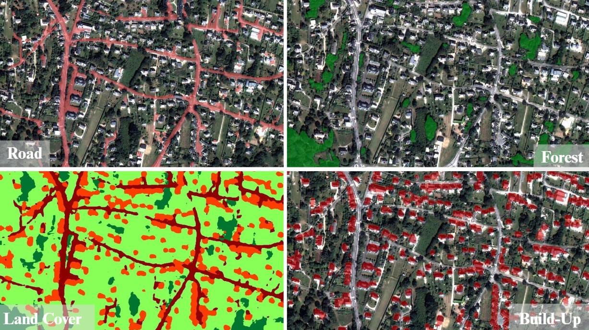

# SemanticSeg4EO
### A Framework for Semantic Segmentation of Earth Observation Imagery

SemanticSeg4EO is a research-oriented framework dedicated to the semantic segmentation of satellite imagery. It provides tools for both multi-class and binary segmentation and integrates a broad set of established deep learning architectures adapted for remote sensing applications. The framework emphasizes methodological transparency, reproducibility, and flexibility, allowing users to modify architectural components, preprocessing strategies, and training settings.

---

## Table of Contents
- [Overview](#overview)
- [Features](#features)
- [Installation](#installation)
- [Data Structure](#data-structure)
- [Training Procedures](#training-procedures)
- [Inference](#inference)
- [Supported Architectures](#supported-architectures)
- [Model Output Format](#model-output-format)
- [Examples](#examples)
- [Recommended Practices](#recommended-practices)
- [Troubleshooting](#troubleshooting)
- [License](#license)
- [Contact](#contact)

---

# Overview
SemanticSeg4EO has been developed to support experiments in semantic segmentation applied to Earth Observation (EO) data. It provides modules for data handling, model training, evaluation, and inference on both small tiles and full-resolution satellite scenes. The design aims to facilitate reproducible research in EO-based land-cover mapping, object detection, and environmental monitoring.

---

# Features

### Architectures
- **Modified U-Net Architecture**  
  A variant of U-Net incorporating deeper convolutional blocks explicitly defined in the source code.  
  These additional layers are intended to enhance feature extraction in complex multi-spectral data.  
  Both **patch size** and **number of classes** are pre-initialized but can be fully overridden via command-line arguments, enabling controlled experimental conditions.

- **Standard Architectures (via segmentation_models_pytorch)**  
  UNet, UNet++, DeepLabV3, DeepLabV3+, FPN, PSPNet, MANet, PAN, LinkNet.

### Segmentation Capabilities
- Multi-class segmentation (default configuration supports up to six classes, extendable).
- Binary segmentation with optional class-weighting to manage class imbalance (for sentinel-2 data).

### Additional Technical Features
- Multi-channel support (including Sentinel-2 data with up to 10 spectral bands).
- Data augmentation tailored for EO imagery.
- Early stopping, checkpointing, and metric monitoring.
- Large-scene inference through patch tiling and reconstruction.
- Preservation of geospatial metadata for TIFF outputs.
- Computation of standard segmentation metrics (IoU, F1-score, Precision, Recall).

---

# Installation

### Requirements
- Python ≥ 3.8  
- PyTorch ≥ 1.10  
- CUDA recommended for training and large-scene inference  

### Installation Procedure
```bash
git clone https://github.com/your-username/SemanticSeg4EO.git
cd SemanticSeg4EO
pip install -r requirements.txt
```

Minimal `requirements.txt`:
```
torch>=1.10.0
torchvision>=0.11.0
numpy>=1.21.0
rasterio>=1.2.0
tifffile>=2021.7.2
segmentation-models-pytorch>=0.3.0
matplotlib>=3.4.0
tqdm>=4.62.0
scipy>=1.7.0
```

---

# Data Structure

The default dataset structure follows:

```
dataset_root/
├── Patch/
│   ├── train/
│   │   ├── images/
│   │   └── labels/
│   ├── validation/
│   │   ├── images/
│   │   └── labels/
│   └── test/
│       ├── images/
│       └── labels/
```

### Image and Label Format
- Images: multi-band `.tif` files  
- Labels: `.tif` semantic masks  
- Multi-class labels: integer encoding from `0` to `N-1`  
- Binary labels: `0` and `1`  

---

# Training Procedures

### Multi-Class Segmentation
```bash
python main.py \
  --dataset_root /path/to/dataset \
  --model unet++ \
  --epochs 100 \
  --batch_size 4 \
  --save_dir ./trained_models \
  --encoder_name resnet34 \
  --pretrained \
  --dropout_rate 0.5 \
  --learning_rate 0.001
```

### Binary Segmentation
```bash
python main_binary.py \
  --dataset_root /path/to/dataset \
  --model unet++ \
  --in_channels 10 \
  --epochs 100 \
  --batch_size 4 \
  --save_dir ./trained_models_binary \
  --encoder_name resnet34 \
  --pretrained \
  --dropout_rate 0.5 \
  --learning_rate 0.001 \
  --data_augmentation \
  --use_class_weights
```

---

# Inference

### Single-Patch Inference (Multi-Class)
```bash
python inference_one_patch.py \
  --model_dir /path/to/models \
  --model_name unet++ \
  --image_path /path/to/image.tif \
  --output_dir ./predictions
```

### Single-Patch Inference (Binary)
```bash
python inference_binary.py \
  --model_dir /path/to/models \
  --model_name unet++ \
  --image_path /path/to/image.tif \
  --threshold 0.3 \
  --output_dir ./predictions
```

### Large-Scene Inference (Multi-Class)
```bash
python predict_large_image.py \
  --model_path /path/to/model.pth \
  --input /path/to/large_image.tif \
  --output /path/to/prediction.tif \
  --model_name unet++ \
  --patch_size 512 \
  --overlap 128 \
  --device cuda
```

### Large-Scene Inference (Binary)
```bash
python predict_large_image_binary.py \
  --model /path/to/model.pth \
  --input /path/to/large_image.tif \
  --output /path/to/prediction.tif \
  --patch_size 224 \
  --overlap 64 \
  --threshold 0.5
```

---

# Supported Architectures

### Custom Model
- Modified U-Net with deeper convolutional blocks explicitly defined in code.  
  This design facilitates controlled experimentation on feature depth and receptive field expansion.

### Standard Architectures (via SMP)
- UNet, UNet++, DeepLabV3, DeepLabV3+, PSPNet, FPN, PAN, MANet, LinkNet.

### Supported Encoders
- ResNet (18 to 152 layers), EfficientNet, DenseNet, VGG, MobileNet, among others.

---

# Model Output Format

During training, the following files are typically generated:
- `{model_name}_final_model.pth`
- `{model_name}_best_loss.pth`
- `{model_name}_best_iou.pth`
- `{model_name}_best_combined.pth`
- `{model_name}_metrics.json`
- `{model_name}_training_plot.png`

Embedded metadata includes:
- Architecture and encoder details  
- Number of input channels  
- Number of semantic classes  
- Training configuration parameters  
- Quantitative performance indicators  
- Geospatial metadata, if applicable  

---

# Examples

### Binary Water Detection Experiment
```bash
python main_binary.py \
  --dataset_root /data/sentinel2_water \
  --model unet++ \
  --in_channels 10 \
  --epochs 150 \
  --batch_size 8 \
  --save_dir ./models/water_detection \
  --encoder_name efficientnet-b3 \
  --pretrained \
  --data_augmentation \
  --use_class_weights \
  --learning_rate 0.0005
```

---

# Recommended Practices

- Consider data augmentation in cases of limited training samples.  
- For large-scene inference, ensure sufficient overlap between patches to mitigate boundary artifacts.  
- Adjust decision thresholds for binary segmentation according to sensitivity requirements.  
- Reduce batch size or patch size if GPU memory constraints arise.  
- Prefer GPU computation for both training and inference.

---



# Troubleshooting

### Dataset Not Detected  
Verify that `.tif` files follow the expected directory convention.

### Channel Mismatch  
Ensure `--in_channels` corresponds to the actual number of spectral bands.

### GPU Memory Exhaustion  
Lower the batch size or inference patch size.

### Border Artifacts  
Increase the overlap value during large-scene prediction.

---

# License
This project is licensed under the MIT License.

---

# Contact
For inquiries, collaborations, or technical questions, please contact:  
**adrien.leguillou@univ-brest.fr**
